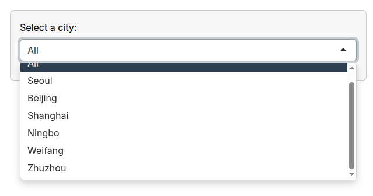
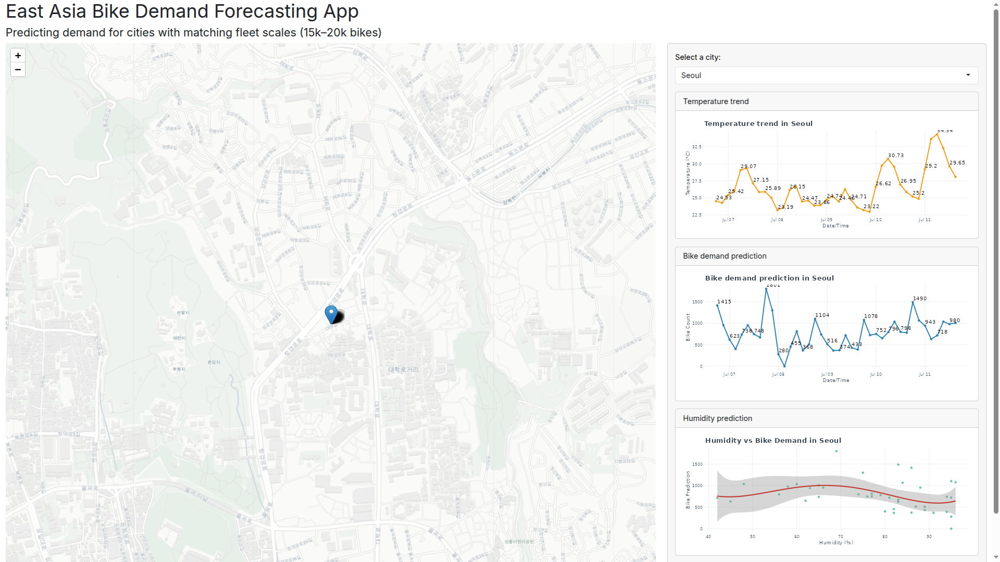

# 🚲 Predicting Hourly Bike-Sharing Demand in Seoul

**By Anatoli Ignatov | May 2026**

[Jupyter Notebook Binder](https://mybinder.org/v2/gh/Ignatimus/data-analysis-portfolio/main?urlpath=%2Fdoc%2Ftree%2FBike-Sharing-Demand-Case-Study%2FCapstone-Project-Seoul-Bike-Sharing-Jupyter-Notebook.ipynb)  

## 🗂️ About the repo
This folder contains a `.ipynb` **Jupyter Notebook** and supporting materials for an end-to-end data science project focused on predicting hourly bike-sharing demand in Seoul, South Korea. Inside the notebook you will find:

1. **Project Summary** — Dataset background, business objective, and project workflow
2. **Data Collection** — Web scraping with `rvest` and API data collection with `httr`
3. **Data Cleaning & Wrangling** — Regular expressions, feature engineering, normalization, and missing-value handling
4. **SQL Exploratory Analysis** — SQL queries for seasonality, weather patterns, and bike demand trends
5. **Visual Exploratory Analysis** — Statistical visualizations built with `ggplot2`
6. **Regression Modeling** — Baseline and refined linear regression models with polynomial features, interaction terms, and regularization
7. **Final Reflections** — Key findings, limitations, and lessons learned

Additionally, there is a **Visualizations** folder containing exported plots and charts generated throughout the analysis.

This **README** also includes a [Binder link](https://mybinder.org/v2/gh/Ignatimus/data-analysis-portfolio/main?urlpath=%2Fdoc%2Ftree%2FBike-Sharing-Demand-Case-Study%2FCapstone-Project-Seoul-Bike-Sharing-Jupyter-Notebook.ipynb) to launch the notebook via **Binder**, which I recommend using instead of opening the notebook directly from this repo (note: it may take a minute to load).

---

## 📎 Dataset
The primary dataset used in this project is the **Seoul Bike Sharing Demand Dataset**, publicly available on the [UCI Machine Learning Repository](https://archive.ics.uci.edu/ml/datasets/Seoul+Bike+Sharing+Demand).

The dataset contains hourly bike rental information together with weather and seasonal variables.

Variable | Description |
-----|-----|
Date | Observation date |
Rented Bike Count | Number of rented bikes per hour |
Hour | Hour of the day |
Temperature | Temperature in °C |
Humidity | Humidity percentage |
Wind speed | Wind speed in m/s |
Visibility | Visibility distance |
Dew point temperature | Dew point temperature in °C |
Solar Radiation | Solar radiation level |
Rainfall | Rainfall amount |
Snowfall | Snowfall amount |
Seasons | Winter, Spring, Summer, Autumn |
Holiday | Whether the day is a holiday |
Functioning Day | Whether the bike-sharing system operated normally |

Additional external data was collected through:
- **Wikipedia web scraping** for global bike-sharing system information
- **OpenWeather API** for live weather forecast data

---

## 🛠️ Tools Used
* JupyterLab
   * R
      * tidyverse
      * dplyr
      * ggplot2
      * stringr
      * rvest
      * httr
      * readr
      * RSQLite
      * tidymodels
      * glmnet

---

## ❓ Business Problem
The objective of this project is to answer the following question:

**Can hourly bike-sharing demand in Seoul be predicted accurately using weather, seasonal, and time-based variables?**

Accurate demand forecasting can help bike-sharing systems:
- Improve bike distribution efficiency
- Reduce shortages and overcrowding
- Optimize operational planning
- Better prepare for seasonal and weather-related demand fluctuations

---

## 💡 Key Insights from Data Analysis
1. Bike demand strongly increases during warmer temperatures and favorable weather conditions.
2. Rental activity follows a clear hourly cycle, with peak demand occurring during commuting hours.
3. Summer and autumn showed the highest average rental counts.
4. Rainfall and snowfall significantly reduce bike demand.
5. Bike rentals are substantially lower during winter months.
6. Weather variables alone were not sufficient for strong predictive performance — time and seasonal variables improved the model considerably.
7. Polynomial and interaction features improved model fit by capturing nonlinear relationships in the data.

---

## 🧠 Model Development and Evaluation
Several regression models were developed and compared throughout the project:

* **Baseline Linear Regression (Weather Variables Only)** — Limited predictive power.
* **Expanded Linear Regression** — Included time, seasonality, and categorical variables.
* **Polynomial Regression** — Captured nonlinear relationships between weather and demand.
* **Interaction-Term Regression** — Improved performance by modeling combined variable effects.
* **Regularized Regression with glmnet** — Reduced overfitting and improved generalization.

Model evaluation included:
- RMSE
- R²
- Residual analysis
- Q-Q calibration plots
- Comparative visualization of experiments

The refined regression models significantly outperformed the baseline specifications.

---

## 📊 Interactive Shiny Dashboard

To complement the notebook analysis, I developed and deployed an interactive **R Shiny dashboard** that transforms the regression model into a practical forecasting application. Rather than simply presenting historical analysis, the dashboard allows users to explore supported cities, visualize recent weather conditions, and generate bike demand predictions using live weather data.

🔗 **Live Dashboard:** [East Asia Bike Demand Forecasting App](https://019efabf-1f9d-038b-8f82-26fb655d258a.share.connect.posit.cloud/)

Unlike the notebook, which focuses on exploratory analysis and model experimentation, the dashboard serves as the project's deployment layer—demonstrating how a trained machine learning model can be integrated into an interactive analytical application.

## 🧠 A New Prediction Model Was Required

The regression models developed in the notebook achieved stronger predictive performance by utilizing every informative feature available in the original Seoul Bike Sharing dataset.

However, deploying a real-world forecasting application introduced a practical constraint:

The dashboard retrieves **live weather forecasts** from the **OpenWeather API**, which does **not** provide every feature contained in the historical dataset. Most notably, the API does **not** include **Solar Radiation**, one of the predictors used in the notebook's refined regression models.

Because a deployed model can only make predictions using variables available at prediction time, the original notebook models could not be used directly.

Rather than attempting to estimate or impute unavailable variables, I trained a completely new regression model using only features that are both:

- available in the historical training data, and
- supplied by the OpenWeather API.

This ensures that every prediction shown in the dashboard is generated using actual live weather measurements rather than artificially estimated inputs, making the application suitable for real-world deployment.

---

## ⚙️ Production Regression Model

The dashboard uses a regularized **Elastic Net Regression** model implemented with the **tidymodels** ecosystem.

### Model Pipeline

The workflow consisted of:

- Removing unavailable that don't contribute to prediction or aren't available on the API side (`DATE`, `FUNCTIONING_DAY`, `SOLAR_RADIATION`)
- 75/25 Train/Test split
- 5-fold Cross Validation
- Hyperparameter tuning for:
  - penalty (λ)
  - mixture (Elastic Net mixing parameter)
- Feature engineering using a preprocessing recipe
- Final model training using **glmnet**

### Feature Engineering

The preprocessing pipeline includes:

- Conversion of **Hour** into a categorical variable
- One-hot encoding of categorical predictors
- Normalization of numeric predictors
- Polynomial feature generation (degree 3)
- Interaction terms between:
  - Temperature × Summer
  - Temperature × Winter
  - Temperature × Humidity

This allows the model to capture nonlinear weather relationships while maintaining good generalization through Elastic Net regularization.

---

## 📈 Production Model Performance

Although this model excludes Solar Radiation, it still produces strong predictive performance suitable for an interactive forecasting application.

| Metric | Value |
|---------|------:|
| RMSE | **334** |
| R² | **0.723** |

---

## 🗺️ Dashboard Features

Current functionality includes:

- Interactive Leaflet map displaying supported East Asian cities
- City selection through an interactive dropdown menu
- Live weather forecast retrieval from the OpenWeather API
- Hourly bike demand prediction using the trained Elastic Net model
- Temperature trend visualization
- Bike demand forecast visualization
- Humidity vs. predicted demand analysis
- Dynamic plots generated from live forecast data

Each supported city automatically updates the map location, weather data, visualizations, and bike demand predictions.

---

## 🛠️ Technologies Used

The dashboard was developed using:

- **R Shiny**
- **tidymodels**
- **glmnet**
- **Leaflet**
- **ggplot2**
- **dplyr**
- **httr**
- **jsonlite**
- **OpenWeather API**

---

## 🖼️ Dashboard Preview

### Interactive Map

The Leaflet map provides a geographical overview of supported cities. Selecting a location centers the map while synchronizing the dashboard's prediction pipeline.

---

### City Selection Interface

The application allows users to select among multiple East Asian cities with comparable public bike-sharing systems. Selecting a city dynamically updates all visualizations and predictions.

---

### Live Forecast Dashboard

For each selected city, the dashboard displays:

- Live temperature forecasts
- Predicted hourly bike demand
- Humidity versus predicted demand relationship
- Interactive visualizations generated from real-time weather data

---

## 💡 Project Outcome

This dashboard represents the deployment stage of the project, bridging statistical modeling with an interactive analytical application.

Combined with the notebook, the complete project demonstrates an end-to-end data science workflow including:

- Data acquisition
- Web scraping
- REST API integration
- Data cleaning and preprocessing
- SQL analysis
- Exploratory Data Analysis (EDA)
- Feature engineering
- Regression modeling
- Hyperparameter tuning
- Model evaluation
- Interactive dashboard development
- Deployment of a machine learning application using live external data

The result is a reproducible analytics project that moves beyond offline experimentation by delivering real-time predictions through an accessible web interface.

---
