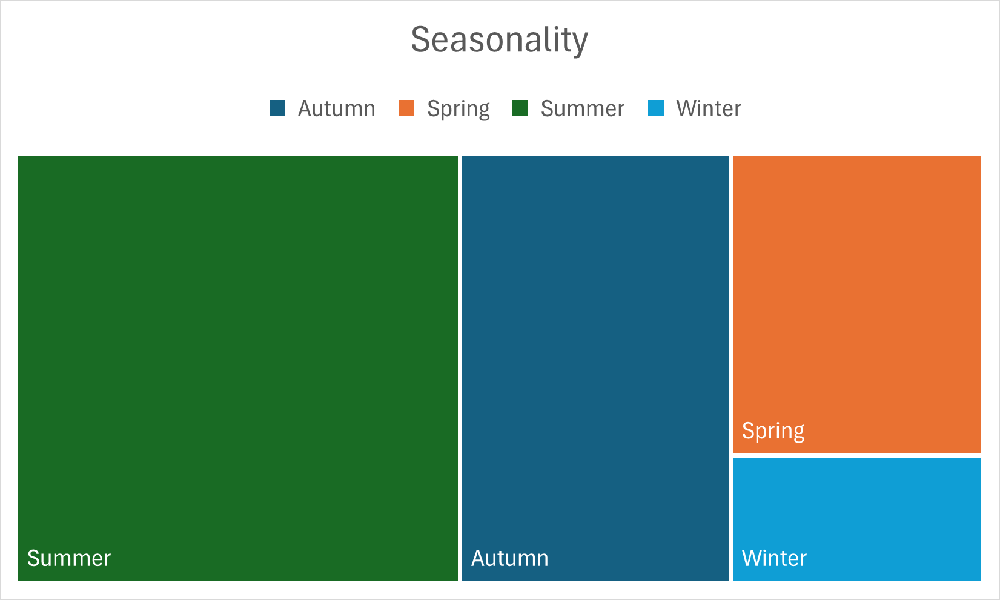

Cyclistic Case Study: How Does a Bike-Share Navigate Speedy Success?
================
Anatoli Ignatov
2025-07-10

## 1.Ask

### Business Task

Cyclistic wants to increase the number of annual members. To do this, we
need to analyze how annual members and casual riders use Cyclistic bikes
differently. The goal is to provide actionable insights to support a
marketing strategy aimed at converting casual riders into annual
members.

### How can the insights drive business decisions?

By identifying the behavioral patterns, preferences, and usage trends of
both casual riders and annual members, the marketing team can:

- Create campaigns tailored to casual riders’ habits.
- Emphasize the benefits of membership based on actual usage data.

### Stakeholders

- **Lilly Moreno** (Director of Marketing);
- **Cyclistic Marketing Analytics Team**;
- **Cyclistic Executive Team**.

------------------------------------------------------------------------

## 2. Prepare

### Data Source

Public trip data from [Divvy
Bikes](https://divvy-tripdata.s3.amazonaws.com/index.html) (a real-world
bike-share program managed by Motivate International Inc.). For this
case study, the data is used to represent the fictional company
Cyclistic.

### Data Summary

- **Time Period**: June 2024 - June 2025 (12 months)
- **Format**: 12 CSV files (one per month)
- **Average Volume**: ~500,000 rows/month

### Key Variables

- **ride_id** (unique trip identifier);
- **rideable_type** (type of bike: classic, electric, or docked);
- **started_at** and **ended_at** (start/end times);
- **start_station_name**, **end_station_name**;
- **start_lat**, **start_lng**, **end_lat**, **end_lng** (coordinates);
- **member_casual** (user type: member or casual).

### Data Preparation

1.  Downloaded the 12 CSV files;
2.  Made copies of the originals;
3.  Renamed and organized the copies in a dedicated project folders.

### Initial Assessment

Performed spot checks in Excel for:

- Consistent file structures
- Missing value patterns

------------------------------------------------------------------------

## 3. Process

### Tools Used

- **RStudio** (tidyverse, lubridate, dplyr, readr, knitr, ggplot2)
- **Microsoft Excel** (initial data review)

------------------------------------------------------------------------

### Data Preparation

**Step 1**: Load required packages

``` r
library(tidyverse)
library(lubridate)
library(dplyr)
library(readr)
```

**Step 2**: Import each data file:

``` r
divvy_trip_data <- read.csv("")
```

------------------------------------------------------------------------

### Data Cleaning

**Step 3**: Handled missing data - removed NA values with:

``` r
[complete.cases()]
```

------------------------------------------------------------------------

### Data Transformation

**Step 4**: Combined all 12, now cleaned, data frames using data frame
list:

``` r
df_list <- list(cleaned_divvy_data)
Divvy_tripdata <- bind_rows(df_list)
```

**Step 5**: Save the combined data

``` r
write_csv(Divvy_tripdata, "Divvy_tripdata.csv")
```

**Step 6**: Calculate ride length (in minutes)

Convert timestamps to POSIXct, then create ride_length and filter out
outliers (rides \<1 minute and \> 24 hours):

``` r
Divvy_tripdata <- Divvy_tripdata %>%
  mutate(
    started_at = as.POSIXct(started_at, format = "%Y-%m-%d %H:%M:%S"),
    ended_at = as.POSIXct(ended_at, format = "%Y-%m-%d %H:%M:%S"),
    ride_length = as.numeric(difftime(ended_at, started_at, units = "mins"))) %>%
  filter(ride_length > 1 & ride_length < 1440)
```

**Step 7**: Created “**day_of_week**”:

``` r
mutate(day_of_week = wday(started_at, label = FALSE, abbr = TRUE))
```

**Step 8**: Created “**day_type**” (Weekday/Weekend)

``` r
mutate(day_type = case_when(
    day_of_week %in% c("нед", "съб") ~ "Weekend",
    TRUE ~ "Weekday"
```

**Step 9**: Created “**month & season**”:

``` r
mutate(month = month(started_at, label = TRUE),
         season = case_when(
           month(started_at) %in% c(12, 1, 2) ~ "Winter",
           month(started_at) %in% c(3, 4, 5) ~ "Spring",
           month(started_at) %in% c(6, 7, 8) ~ "Summer",
           month(started_at) %in% c(9, 10, 11) ~ "Autumn"))
```

------------------------------------------------------------------------

## 4. Analyze

### Basic Statistics

``` r
summary_stats <- Divvy_tripdata %>%
  summarise(
    mean_ride_length = mean(ride_length),
    median_ride_length = median(ride_length),
    max_ride_length = max(ride_length),
    min_ride_length = min(ride_length))
kable(summary_stats)
```

| mean_ride_length | median_ride_length | max_ride_length | min_ride_length |
|-----------------:|-------------------:|----------------:|----------------:|
|           16.482 |           10.17325 |        1439.385 |        1.000017 |

### By User Type

``` r
summary_stats_2 <- Divvy_tripdata %>%  
  group_by(member_casual) %>%  
  summarise(
    total_rides = n(),
    avg_duration = mean(ride_length),
    median_duration = median(ride_length),
    rides_weekend_perc = sum(day_type == "Weekend") / n() * 100)
kable(summary_stats_2)
```

| member_casual | total_rides | avg_duration | median_duration | rides_weekend_perc |
|:--------------|------------:|-------------:|----------------:|-------------------:|
| casual        |     1622232 |     23.55465 |       13.362983 |           38.09659 |
| member        |     2755085 |     12.31753 |        8.816917 |           23.51125 |

### Most Popular Day

``` r
mode_day <- Divvy_tripdata %>%
  count(day_of_week) %>%
  arrange(desc(n)) %>%
  slice(1)
```

| day_of_week |      n |
|:------------|-------:|
| Saturday    | 681984 |

### Average ride length by user type and day

``` r
avg_ride_by_type_day <- Divvy_tripdata %>%
  group_by(member_casual, day_of_week) %>%
  summarise(avg_ride_length = mean(ride_length))
```

| User Type | Day of the Week | Average Ride Length |
|:----------|:----------------|--------------------:|
| casual    | Monday          |            22.59759 |
| casual    | Tuesday         |            20.54972 |
| casual    | Wednesday       |            20.51346 |
| casual    | Thursday        |            20.93306 |
| casual    | Friday          |            22.97448 |
| casual    | Saturday        |            26.56174 |
| casual    | Sunday          |            26.88533 |
| member    | Monday          |            11.73705 |
| member    | Tuesday         |            11.77046 |
| member    | Wednesday       |            11.89111 |
| member    | Thursday        |            11.85737 |
| member    | Friday          |            12.14726 |
| member    | Saturday        |            13.72069 |
| member    | Sunday          |            13.78258 |

### Top Stations

``` r
top_stations <- Divvy_tripdata %>%
  group_by(member_casual, start_station_name) %>%
  summarise(rides = n()) %>%
  arrange(member_casual, desc(rides)) %>%
  group_by(member_casual) %>%
  slice(1:10)
```

| member_casual | start_station_name                 | rides |
|:--------------|:-----------------------------------|------:|
| casual        | Streeter Dr & Grand Ave            | 51604 |
| casual        | DuSable Lake Shore Dr & Monroe St  | 34364 |
| casual        | Michigan Ave & Oak St              | 25189 |
| casual        | DuSable Lake Shore Dr & North Blvd | 22893 |
| casual        | Millennium Park                    | 22289 |
| casual        | Shedd Aquarium                     | 20895 |
| casual        | Dusable Harbor                     | 18842 |
| casual        | Theater on the Lake                | 16664 |
| casual        | Michigan Ave & 8th St              | 13226 |
| casual        | Adler Planetarium                  | 12253 |
| member        | Kingsbury St & Kinzie St           | 30459 |
| member        | Clinton St & Washington Blvd       | 25368 |
| member        | Clinton St & Madison St            | 23353 |
| member        | Clark St & Elm St                  | 23166 |
| member        | Canal St & Madison St              | 20158 |
| member        | Clinton St & Jackson Blvd          | 19533 |
| member        | State St & Chicago Ave             | 18619 |
| member        | Wells St & Elm St                  | 18541 |
| member        | Wells St & Concord Ln              | 18392 |
| member        | Dearborn St & Erie St              | 17287 |

### Seasonal Usage

``` r
seasonal_usage <- Divvy_tripdata %>%
  group_by(season, member_casual) %>%
  summarise(
    avg_ride_length = mean(ride_length),
    total_rides = n())
```

| season | member_casual | avg_ride_length | total_rides |
|:-------|:--------------|----------------:|------------:|
| Autumn | casual        |        21.64478 |      441108 |
| Autumn | member        |        11.88422 |      783969 |
| Spring | casual        |        21.98043 |      261922 |
| Spring | member        |        11.68382 |      541390 |
| Summer | casual        |        25.73935 |      854737 |
| Summer | member        |        13.42133 |     1154585 |
| Winter | casual        |        14.05237 |       64465 |
| Winter | member        |        10.16720 |      275141 |

### Bike Share

``` r
bike_share <- Divvy_tripdata %>%
  group_by(member_casual, rideable_type) %>%
  summarise(rides = n(), .groups = "drop") %>%
  group_by(member_casual) %>%
  mutate(percent = round(100 * rides / sum(rides), 1))
```

| member_casual | rideable_type    |   rides | percent |
|:--------------|:-----------------|--------:|--------:|
| casual        | classic_bike     |  978976 |    60.3 |
| casual        | electric_bike    |  617983 |    38.1 |
| casual        | electric_scooter |   25273 |     1.6 |
| member        | classic_bike     | 1680799 |    61.0 |
| member        | electric_bike    | 1052613 |    38.2 |
| member        | electric_scooter |   21673 |     0.8 |

## Summary of Findings

### Key Metrics Comparison

| Metric             | Casual Riders           | Members                  |
|--------------------|-------------------------|--------------------------|
| Avg Ride Length    | 23.6 mins               | 12.3 mins                |
| Median Ride Length | 14.7 mins               | 10.1 mins                |
| Top Day            | Saturday                | Thursday                 |
| Peak Season        | Summer                  | Summer                   |
| Most Used Station  | Streeter Dr & Grand Ave | Kingsbury St & Kinzie St |

### Seasonal Trends

- **Casual** rider usage during the winter drops by 85%
- **Member** rider usage during the winter drops by 76%

### Time of Day

- **Casual**: Relatevly consistent throughout the day
- **Members**: Peak during rush hpurs commute (7-9, 16-18)

### Day of Week

- Weekends show increase for both Members and Casual

### Bike Type Preferences

Both Members and Casual show close bike preferences:

- Classic Bikes: ~60%
- Electric Bikes: ~38%
- Electric Scooters: ~1%

------------------------------------------------------------------------

## 5. Share

### Key Question Answered

*How do annual members and casual riders use Cyclystic bikes
differently?*

### Summary:

- **Casual Riders**: Leisure-oriented, prefer weekends, long rides,
  tourist locations
- **Members**: Commute-focused, ride more during weekdays and rush
  hours, prefer business district stations

### Vizualizations

#### Ride Frequency and Duration


**Insight**: Members significantly outnumber casual riders in total
trips, highlighting their consistent usage.

------------------------------------------------------------------------


**Surprise**: Casual riders’ average ride length is nearly double that
of members, reinforcing the idea for leisurely use.

------------------------------------------------------------------------

#### Time-Based Usage Patterns


**Insight**: Members show clear peaks during rush hours (7–9 and 16–18),
aligning with work commutes. Casual rides are more evenly distributed,
with slight peaks on the afternoon.

------------------------------------------------------------------------


**Insight**: Overall rides spike on weekends (especially Saturdays) by
both groups.

------------------------------------------------------------------------


**Insight**: Again it shouwcases Casual riders’ trips being consistently
longer than members’, with both groups riding slightly longer on
weekends.

------------------------------------------------------------------------


**Insight**: Showcases the weekly trend for total rides, and confirms
the alredy established trend.

------------------------------------------------------------------------


**Insight**: A broader view confirms that while weekend spikes are
noticeable, the overall ride increase is not drastic.

------------------------------------------------------------------------



***Insight***: Seasonal patterns align with expectations—higher
ridership in warmer months and lower in the colder ones.

------------------------------------------------------------------------

#### Bike Type Preferences


**Insight**: Both groups prefer classic bikes (~60%), but casual riders
use electric bikes slightly more (38% vs. 35% for members). Dockless
scooters are negligible for both.

------------------------------------------------------------------------

#### Most Popular Start Stations


**Insight**: Casual riders frequent tourist-heavy areas (e.g., Streeter
Dr & Grand Ave near Navy Pier).

------------------------------------------------------------------------


**Insight**: Members prioritize stations near business districts (e.g.,
Kingsbury St & Kinzie St in the West Loop).

------------------------------------------------------------------------

## 6. Act

### Strategic Recommendations

- **Weekend Memberships**: Introduce an “Unlimited Weekends” pass
- **Seasonal Campaigns**: Offer summer deals and winter loyalty perks
- **Commuter Conversion**: Target casuals with frequent weekday use

# Final Reflections

This Cyclistic case study was my first hands-on project after completing
the Google Data Analytics Certificate. It helped me apply what I learned
— especially data cleaning, transformation, and visualization — to a
real-world business problem.

Working with real data had its challenges, like missing values and
inconsistent formats, but it also showed the importance of staying
organized and following a clear process. I analyzed patterns in user
behavior, such as seasonal trends, and turned those insights into
simple, practical recommendations.

This project is my starting point in building a strong data portfolio.
The steps I followed — asking the right questions, preparing and
analyzing the data, and sharing insights — will guide my future work in
analytics.

Anatoli Ignatov
