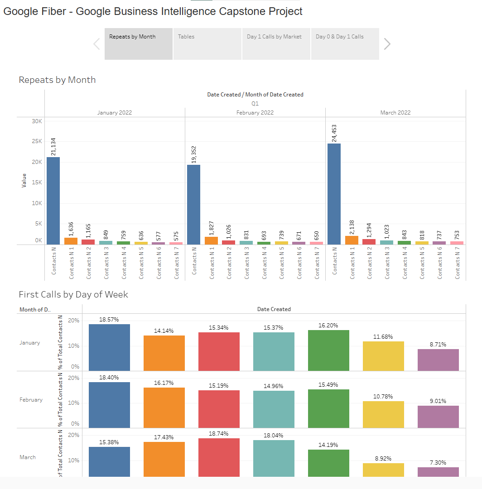
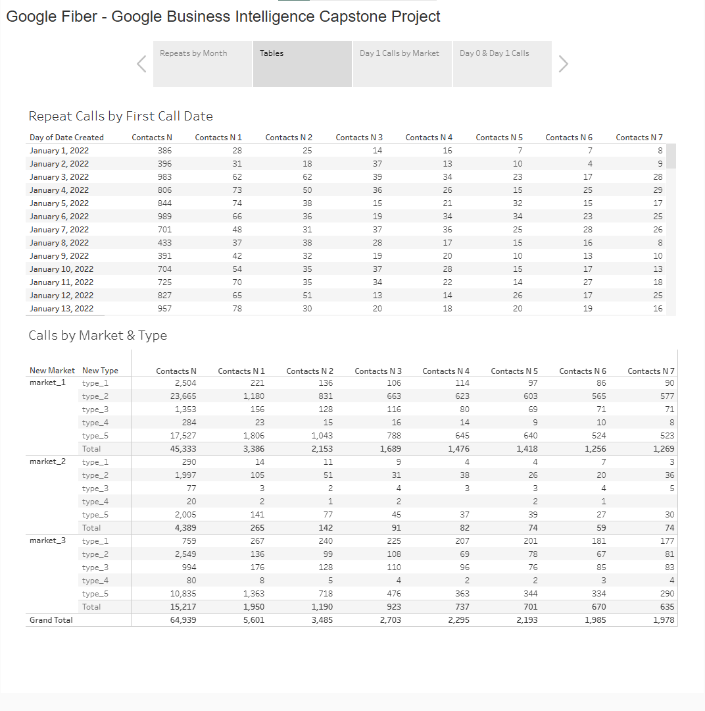
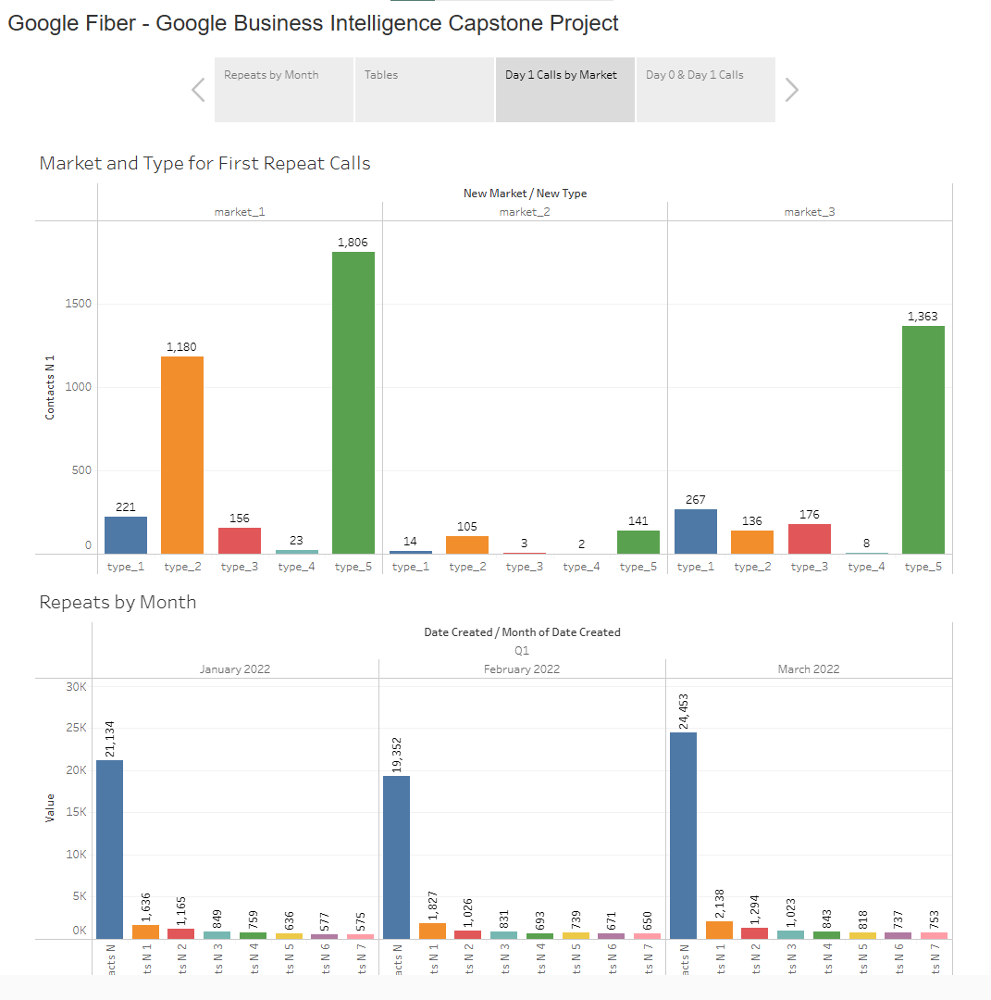
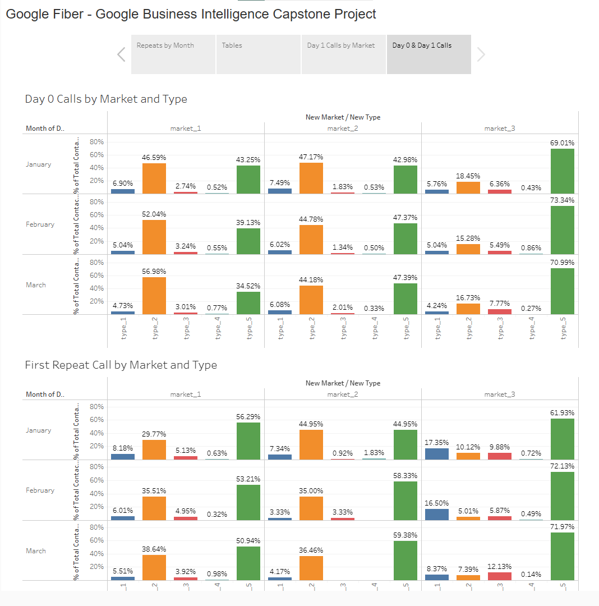

# 🛜 Google Fiber - Google Business Intelligence Case Study

**By Anatoli Ignatov | December 2025**

[Tableau Public Dashboard](https://public.tableau.com/shared/F582FPZQW?:display_count=n&:origin=viz_share_link)
## 🗂️ About the repo
This folder contains the **README** for the **Google Fiber Business Intelligence Capstone Project**. A **Visualizations** folder is included with exported images of the Tableau dashboard. The CSV files are included in the **Datasets** folder. 

Inside this README you will find:  
1. Dataset sources  
2. SQL pipeline used to prepare the final analysis table  
3. Explanations of the logic behind the query  
4. Link to the Tableau Public dashboard 

## 📎 Datasets
Available on **Google Sheets**: 
- [Market 1](https://docs.google.com/spreadsheets/d/1a9IKjkvOvYHRx84SyRdp4Sq81EzgeOZPufcRtrUcAIc/template/preview#gid=775366698),
- [Market 2](https://docs.google.com/spreadsheets/d/19CINdvAwp-2RF5pphkLywZLQJyJu66EOjX6CgrW32nA/template/preview#gid=2065220237),
- [Market 3](https://docs.google.com/spreadsheets/d/1K6X9ZhjWtbneBss7PQH7IobGCzQ5NzG1hxs1D-hbsZM/template/preview?resourcekey=0-q90E-1XwD8nkNSjs0Ws3-w)

## 🛠️ Tools Used
* BigQuery
* Tableau

## ❓ Business Problem
The team needs to understand **how often customers call customer support after their first inquiry**. This will help leadership understand how effectively the team can answer customer questions the first time.

## 🧮 Querying the Data
```sql
SELECT
    *
FROM `coursera-460808.fiber.market_1`
UNION ALL

SELECT
  *
FROM `coursera-460808.fiber.market_2`
UNION ALL

SELECT
  *
FROM `coursera-460808.fiber.market_3`
```
## 📄 Final Table

| Variable     | Description                                                                                                                                                                              |
| ------------ | ---------------------------------------------------------------------------------------------------------------------------------------------------------------------------------------- |
| date_created | Date when the initial contact or record was created                                                                                                                                      |
| contacts_n   | Number of contacts on the initial contact date                                                                                                                                           |
| contacts_n_1 | Number of repeat contacts 1 day after the initial contact                                                                                                                                |
| contacts_n_2 | Number of repeat contacts 2 days after the initial contact                                                                                                                               |
| contacts_n_3 | Number of repeat contacts 3 days after the initial contact                                                                                                                               |
| contacts_n_4 | Number of repeat contacts 4 days after the initial contact                                                                                                                               |
| contacts_n_5 | Number of repeat contacts 5 days after the initial contact                                                                                                                               |
| contacts_n_6 | Number of repeat contacts 6 days after the initial contact                                                                                                                               |
| contacts_n_7 | Number of repeat contacts 7 days after the initial contact                                                                                                                               |
| new_type     | Type of problem reported: Type_1 (account management), Type_2 (technician troubleshooting), Type_3 (scheduling), Type_4 (construction), Type_5 (internet and wifi) |
| new_market   | City service area where the contact occurred; anonymized as market_1, market_2, or market_3                                                                                              |


## 📊 Dashboard - [Link](https://public.tableau.com/shared/64JDZRJ8H?:display_count=n&:origin=viz_share_link)

### 📌 Dashboard Overview

### 1️⃣ Repeats by Month

This tab visualizes **repeat calls** and **first contact calls**, helping the customer service team understand call frequency and patterns over time.

#### **Repeat Calls by Month (Bar Chart)**
- **Contacts_N** represents the initial contact date.  
- Subsequent columns (**contacts_n_1** to **contacts_n_7**) track repeat calls up to seven days after the initial contact.  
- Example: In January, 1,636 customers called again **1 day** after their first call, while only 575 called again **7 days** later.

**How it was built:**  
- Month extracted from `date_created` → Columns  
- SUM of each `contacts_n` column → Rows  
- Each day after first contact → Color  

#### **First Contact Calls by Day of Week (Bar Chart)**
- Shows the percentage of initial calls for each day of the week.  
- Example: Only 8.71% of customers made first contact on Sunday in January; most reached out on Monday.  

**How it was built:**  
- `date_created` → Day of Week → Columns  
- SUM(Contacts_N) → Rows  
- Percentage calculated by total calls per month  

[](https://public.tableau.com/shared/GR23MM2BS?:display_count=n&:origin=viz_share_link)

---

### 2️⃣ Tables

This tab includes **two tables**:

1. **Repeat Calls by First Call Date**  
   - Allows stakeholders to explore the number of different types of calls by date.  
   - Breaks down repeat calls for each customer by day 0 to day 7.  

2. **Calls by Market and Problem Type**  
   - Separates calls by `new_market` (market_1, market_2, market_3) and `new_type` (Type_1: Account Management, Type_2: Technician Troubleshooting, Type_3: Scheduling, Type_4: Construction, Type_5: Internet/WiFi).  
   - Helps identify which markets experience the most calls and which problem types generate repeat calls.  

[](https://public.tableau.com/views/FiberDashboard_17651878097130/Story1?:language=en-US&:sid=&:redirect=auth&:display_count=n&:origin=viz_share_link)

---

### 3️⃣ Day 1 Calls by Market

This visualization drills down into **first repeat calls**, showing which problem types generate repeat contacts across different markets.  

**Insights:**  
- Allows identification of high-repeat problem types by market.  
- Supports operational improvements and staffing adjustments.  

[](https://public.tableau.com/shared/4ZW3C23FK?:display_count=n&:origin=viz_share_link)


### 4️⃣ Day 0 & Day 1 Calls

This tab includes **two charts** visualizing call patterns in the first quarter:

1. **Day 0 Calls by Market and Type Across Q1**  
   - Tracks initial contact calls across markets and problem types.  

2. **First Repeat Call by Market and Type Across Q1**  
   - Tracks repeat calls following the first contact, highlighting which problems trigger additional follow-ups.  

**Purpose:**  
- Understand which markets and problem types generate the most calls.  
- Identify areas where process improvements or proactive outreach may reduce repeat contacts.  

[](https://public.tableau.com/shared/NNDM4XD97?:display_count=n&:origin=viz_share_link)
