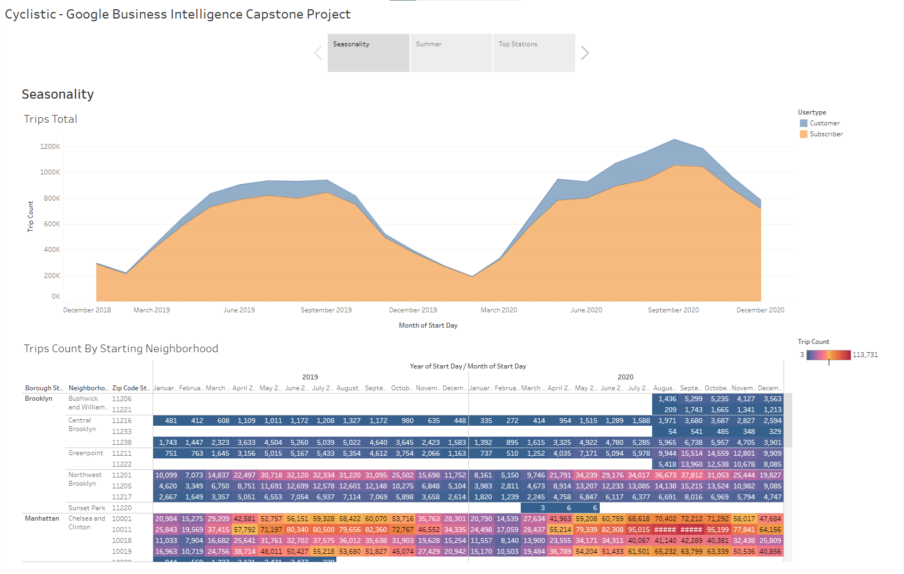

# 🚴 Cyclistic - Google Business Intelligence Capstone Project

**By Anatoli Ignatov | December 2025**

[Tableau Public Dashboard](https://public.tableau.com/views/CyclisticNYCDashboard_17645978518660/Cyclistic-GoogleBusinessIntelligenceCapstoneProject?:language=en-US&:sid=&:redirect=auth&:display_count=n&:origin=viz_share_link)

## 🗂️ About the repo
This folder contains the **README** for the **Cyclistic Business Intelligence Capstone Project**. A **Visualizations** folder is included with exported images of the Tableau dashboard. The CSV files are not included due to size limits. 

Inside this README you will find:  
1. Dataset sources  
2. SQL pipeline used to prepare the final analysis table  
3. Explanations of the logic behind the query  
4. Link to the Tableau Public dashboard 

## 📎 Datasets
Available on **Google Cloud**: 
- [NYC Citi Bike Trips](https://console.cloud.google.com/marketplace/details/city-of-new-york/nyc-citi-bike?project=valid-imagery-386312),
- [Census Bureau US Boundaries](https://console.cloud.google.com/marketplace/product/united-states-census-bureau/us-geographic-boundaries?project=valid-imagery-386312),
- [GSOD](https://console.cloud.google.com/marketplace/details/noaa-public/gsod?project=valid-imagery-386312)
- [Cyclistic NYC zip codes](https://docs.google.com/spreadsheets/d/1IIbH-GM3tdmM5tl56PHhqI7xxCzqaBCU0ylItxk_sy0/template/preview#gid=806359255)

## 🛠️ Tools Used
* BigQuery
* Tableau

## ❓ Business Problem
The company’s Customer Growth Team is creating a business plan for next year. They want to understand how their customers are using their bikes; **Their top priority is identifying customer demand at different station locations.**

## 🧮 Querying the Data
```sql
-- SELECT CLAUSE: Defining output columns
SELECT 
    -- User information
    TRI.usertype,
    
    -- Starting location details
    ZIPSTART.zip_code AS zip_code_start,
    ZIPSTARTNAME.borough borough_start,
    ZIPSTARTNAME.neighborhood AS neighborhood_start,
    
    -- Ending location details
    ZIPEND.zip_code AS zip_code_end,
    ZIPENDNAME.borough borough_end,
    ZIPENDNAME.neighborhood AS neighborhood_end,
    
    -- Trip timing (Adjusting 5 years forward for dashboarding)
    DATE_ADD(DATE(TRI.starttime), INTERVAL 5 YEAR) AS start_day,
    DATE_ADD(DATE(TRI.stoptime), INTERVAL 5 YEAR) AS stop_day,
    
    -- Weather conditions
    WEA.temp AS day_mean_temperature,
    WEA.wdsp AS day_mean_wind_speed,
    WEA.prcp day_total_precipitation,
    
    -- Trip metrics (Grouping trips into 10 minute intervals to reduces the number of rows)
    ROUND(CAST(TRI.tripduration / 60 AS INT64), -1) AS trip_minutes,
    COUNT(TRI.bikeid) AS trip_count

-- PRIMARY DATA SOURCE: Citibike trip records
FROM 
    bigquery-public-data.new_york_citibike.citibike_trips AS TRI

-- GEOGRAPHIC JOINS: Match stations to zip codes

    -- Join start station coordinates to zip code boundaries
INNER JOIN 
    bigquery-public-data.geo_us_boundaries.zip_codes ZIPSTART 
    ON ST_WITHIN(
        ST_GEOGPOINT(TRI.start_station_longitude, TRI.start_station_latitude),
        ZIPSTART.zip_code_geom)

    -- Join end station coordinates to zip code boundaries
INNER JOIN 
    bigquery-public-data.geo_us_boundaries.zip_codes ZIPEND 
    ON ST_WITHIN(
        ST_GEOGPOINT(TRI.end_station_longitude, TRI.end_station_latitude),
        ZIPEND.zip_code_geom)

-- WEATHER DATA JOIN: Daily conditions from Central Park station
INNER JOIN 
    bigquery-public-data.noaa_gsod.gsod20* AS WEA 
    ON PARSE_DATE("%Y%m%d", CONCAT(WEA.year, WEA.mo, WEA.da)) = DATE(TRI.starttime)

-- NEIGHBORHOOD DETAILS: Add borough and neighborhood names

    -- Add neighborhood details for starting zip code
INNER JOIN 
    `coursera-460808.cyclistic.zip_codes` AS ZIPSTARTNAME 
    ON ZIPSTART.zip_code = CAST(ZIPSTARTNAME.zip AS STRING)

    -- Add neighborhood details for ending zip code
INNER JOIN 
    `coursera-460808.cyclistic.zip_codes` AS ZIPENDNAME 
    ON ZIPEND.zip_code = CAST(ZIPENDNAME.zip AS STRING)

-- FILTERS: Limit data to specific weather station and time period
WHERE 
    -- Use only Central Park weather station data
    WEA.wban = '94728'
    -- Limit to 2014-2015 trip data
    AND EXTRACT(YEAR FROM DATE(TRI.starttime)) BETWEEN 2014 AND 2015

-- GROUPING: Aggregate by all non-aggregated columns
GROUP BY 
    1, 2, 3, 4, 5, 6, 7, 8, 9, 10, 11, 12, 13
```
## 📄 Final Table

| Variable                | Description                                                |
| ----------------------- | ---------------------------------------------------------- |
| usertype                | Type of user (e.g., subscriber vs customer)                |
| zip_code_start          | ZIP code where the trip started                            |
| borough_start           | Borough where the trip started                             |
| neighborhood_start      | Neighborhood where the trip started                        |
| zip_code_end            | ZIP code where the trip ended                              |
| borough_end             | Borough where the trip ended                               |
| neighborhood_end        | Neighborhood where the trip ended                          |
| start_day               | Date when the trip started                                 |
| stop_day                | Date when the trip ended                                   |
| day_mean_temperature    | Average daily temperature for that date                    |
| day_mean_wind_speed     | Average daily wind speed for that date                     |
| day_total_precipitation | Total daily precipitation for that date                    |
| trip_minutes            | Duration of the trip in minutes                            |
| trip_count              | Number of trips aggregated for that date/route combination |

## 📊 Dashboard - [Link](https://public.tableau.com/views/CyclisticNYCDashboard_17645978518660/Cyclistic-GoogleBusinessIntelligenceCapstoneProject?:language=en-US&:sid=&:redirect=auth&:display_count=n&:origin=viz_share_link)

### 📌 Dashboard Overview

### 1️⃣ Seasonal Trends (Full-Year Patterns)

This tab focuses on **year-round behavior** and helps identify when and where Cyclistic experiences the highest demand.

#### **Trip Totals Line Chart**
This visualization tracks the total number of trips per month over the selected time period.  
It separates **customers** (casual riders) from **subscribers** (members), revealing several key points:

- **Subscribers consistently generate the majority of trips**, showing strong brand loyalty and regular usage.
- **Customer usage spikes in warmer months**, while subscriber usage remains more stable throughout the year.
- **May to October** is the core active season, aligning with NYC's typical outdoor activity pattern.
- Winter months show predictable drops in ridership due to weather conditions.

**How it was built:**  
- Start Day → converted to **Month** and used on Columns  
- SUM(Trip Count) → placed on Rows  
- UserType → assigned to Color  

#### **Trip Counts by Starting Neighborhood (Heat-Table)**  
This table presents a geographic and temporal breakdown of ride volume:

- Rows show **Borough** → **Neighborhood** → **ZIP code** hierarchy  
- Columns represent **Year** and **Month**  
- Cells display the **SUM of Trip Count**  
- A color gradient visually emphasizes activity—lighter shades indicate higher trip counts

Insights revealed:

- **Lower East Side**, **Chelsea**, and **Clinton** stand out as the highest-activity zones.
- These neighborhoods consistently perform well across most months, even during seasonal dips.
- Winter activity is low across all neighborhoods, but some boroughs retain moderate subscriber traffic.

---

### 2️⃣ Summer Trends (Peak-Season Patterns)

This tab zooms in on **July, August, and September**, the months with the highest ridership. It helps Cyclistic understand **peak conditions**, which typically represent the highest-stress period for operational resources.

#### **Main Borough Map**
The primary map shows:

- Total trip volumes by **borough**
- Symbol sizes or color intensities proportional to activity
- Immediate visual contrast between Manhattan, Brooklyn, Queens, Bronx, and Staten Island

Manhattan dominates in both raw trip count and trip minutes, consistent with its dense layout and strong commuter flows.

#### **Neighborhood-Level Table**
Next to the map is a comparative table showing:

- Trips by **user type** (customer vs. subscriber)  
- Average trip duration  
- Neighborhood-level differences in summer usage

This table reveals:

- Customers take fewer total trips but often have **longer durations**, suggesting leisure-oriented usage.
- Subscribers take shorter but more frequent trips, consistent with commuting and errands.
- Some neighborhoods have large imbalances between start and end station usage, indicating one-way traffic patterns.

#### **Mini-Maps (July, August, September)**
These three smaller maps highlight:

- Month-by-month spatial differences  
- Which neighborhoods surge at different points in summer  
- How temporary events, tourism, or weather may influence ridership patterns

#### **Interactive Filters**
The tab includes several filters that let users drill into detail:

- **User Type**  
- **Metrics (Trips, Trip Minutes, etc.)**  
- **Month**  
- **Starting Neighborhood**  
- **Ending Neighborhood**  

Any filter or map click dynamically updates both the table and maps. This makes the tab suitable for **ad-hoc exploration** by business stakeholders.

### Page 1: Seasonality Analysis
[](https://public.tableau.com/views/CyclisticNYCDashboard_17645978518660/Cyclistic-GoogleBusinessIntelligenceCapstoneProject

---

### 3️⃣ Top Stations (Trip Minutes Analysis)

This tab highlights neighborhoods that generate the **longest total ride times**, which helps uncover not just where trips start, but where riders are traveling **significant distances**.

#### **Stacked Horizontal Bar Charts**
There are two bar charts:

1. **Trip Minutes by Starting Neighborhood**  
2. **Trip Minutes by Ending Neighborhood**

Both charts show:

- Total trip minutes  
- Split by **customer** vs **subscriber**  
- Sorted from highest to lowest  

This reveals:

- **Lower East Side** and **Chelsea/Clinton** lead in both start and end trip minutes.
- High trip minutes suggest these neighborhoods support:
  - Long leisure rides  
  - Cross-borough travel  
  - Tourist-heavy flows  
- End-station trip minutes help identify where long-distance riders tend to conclude their journeys.

**How it was built:** 
- `SUM(Trip Minutes)` → Columns  
- ZIP Code → Neighborhood → Borough → Rows  
- UserType → Color  

