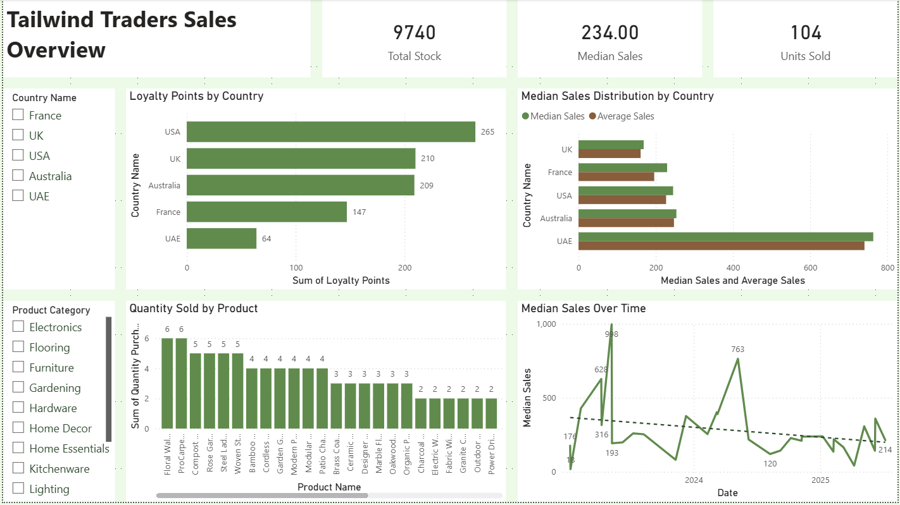
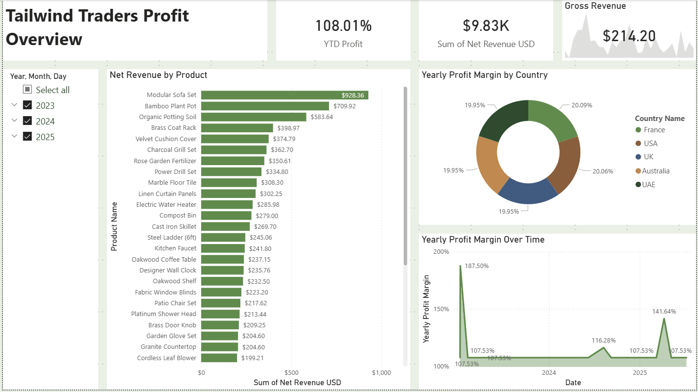

# 📊 Tailwind Traders – Power BI Sales & Profit Dashboard

## 🗂️ About the Repo

This repository documents my end-to-end Power BI case study built around the **Tailwind Traders** sales dataset. It covers every stage of the pipeline: raw data preparation in Excel, multi-source loading and transformation in Power Query, relational data modelling, DAX measure development, and the design of two interactive report pages published to Power BI Service.

Inside this README you will find:

1. Tools and data sources used
2. Excel data preparation steps and formulas
3. Power Query transformation details
4. Data model structure and relationship cardinalities
5. DAX measures with explanations
6. Dashboard walkthrough for both report pages

---

## 🛠️ Tools Used

- **Microsoft Excel** – source data preparation and calculated columns
- **Power BI Desktop** – Power Query, data modelling, DAX, report design
- **Python (pandas)** – loading historical currency exchange rate data into Power BI
- **Power BI Service** – publishing and sharing the final report

---

## 📎 Data Sources

| Table | Description |
|---|---|
| Sales | Core transaction records including product, price, quantity, tax, and rep |
| Purchases | Purchase-level data including dates, return status, and warranty info |
| Countries | Country dimension with country and exchange IDs |
| Exchange Data | Historical currency exchange rates, loaded via Python script |
| CalendarTable | DAX-generated date table for time intelligence |
| Sales in USD | Calculated table: all sales values converted to USD |

---

## 🧹 Data Preparation

### Excel – Calculated Columns

Before loading into Power BI, I extended the **Sales** worksheet in `Tailwind Traders Sales.xlsx` with five calculated columns:

| Column | Formula | Purpose |
|---|---|---|
| Cost per Unit | `=E2 * 0.35` | Derives unit cost as 35% of gross product price |
| Gross Revenue | `=E2 * H2` | Price × quantity purchased |
| Total Tax | `=G2 * H2` | Tax per product × quantity purchased |
| Net Revenue | `=I2 - J2` | Gross revenue minus total tax |
| Profit | `=K2 - (F2 * G2)` | Net revenue minus total product cost |

### Power Query – Type Assignment and Validation

After loading each table I standardised column data types, then used the **Column Quality**, **Column Distribution**, and **Column Profile** views to validate the data before modelling.

Key observations noted during profiling:

- `OrderID` – 100% valid, no nulls or duplicates
- `Gross Product Price` – 50 distinct price points across the catalogue
- `Quantity Purchased` – min: 1, max: 6, average: ~2.81
- `Warranty (Months)` in Purchases – min: 6 months, max: 48 months, average: ~18.88 months

The **Purchases** table was also filtered to exclude returned orders (`ReturnStatus ≠ "Returned"`) to ensure only fulfilled transactions feed the analysis.

### Python Script – Exchange Rate Data

The historical exchange rate table was loaded directly into Power BI using a Python script, avoiding a manual CSV import:

```python
import pandas as pd
from io import StringIO

data = """Exchange ID;ExchangeRate;Exchange Currency
1;1;USD
2;0.75;GBP
3;0.85;EUR
4;3.67;AED
5;1.3;AUD"""

df = pd.read_csv(StringIO(data), sep=';')
```

The resulting `df` table was renamed to **Exchange Data** inside Power BI.

---

## 🔗 Data Model

I built a star-like schema with five relationships:

| Relationship | Key Field | Cardinality | Filter Direction |
|---|---|---|---|
| Countries ↔ Exchange Data | Exchange ID | 1 : 1 | Both |
| Sales ↔ Countries | Country ID | Many : 1 | Both |
| Purchases ↔ Sales | OrderID | 1 : 1 | Both |
| CalendarTable ↔ Purchases | Date / Purchase Date | Many : 1 | Single |
| Sales in USD ↔ Sales | OrderID | 1 : 1 | Both |

### CalendarTable (DAX)

A dedicated date table was created to enable time intelligence functions:

```DAX
CalendarTable =
ADDCOLUMNS(
    CALENDAR(DATE(2020, 1, 1), DATE(2023, 12, 31)),
    "Year",         YEAR([Date]),
    "Month Number", MONTH([Date]),
    "Month",        FORMAT([Date], "MMMM"),
    "Quarter",      QUARTER([Date]),
    "Weekday",      WEEKDAY([Date]),
    "Day",          DAY([Date])
)
```

### Sales in USD (Calculated Table)

To standardise all monetary values to USD, I created a calculated table that extends the base Sales table with converted figures using the related exchange rates:

```DAX
Sales in USD =
ADDCOLUMNS(
    Sales,
    "Country Name",       RELATED(Countries[Country]),
    "Exchange Rate",      RELATED('Exchange Data'[ExchangeRate]),
    "Exchange Currency",  RELATED('Exchange Data'[Exchange Currency]),
    "Cost per Unit USD",  [Cost per Unit]  * RELATED('Exchange Data'[ExchangeRate]),
    "Gross Revenue USD",  [Gross Revenue]  * RELATED('Exchange Data'[ExchangeRate]),
    "Net Revenue USD",    [Net Revenue]    * RELATED('Exchange Data'[ExchangeRate]),
    "Total Tax USD",      [Total Tax]      * RELATED('Exchange Data'[ExchangeRate]),
    "Profit USD",         [Profit]         * RELATED('Exchange Data'[ExchangeRate])
)
```

---

## 🧮 DAX Measures

Four measures were written against the **Sales in USD** table to power the profit report:

```DAX
Yearly Profit Margin =
DIVIDE(
    SUM('Sales in USD'[Profit USD]),
    SUM('Sales in USD'[Net Revenue USD])
)
```
*Divides total profit by net revenue to show what percentage of revenue is retained after costs and tax — a core indicator of financial efficiency.*

```DAX
Quarterly Profit Margin =
CALCULATE(
    [Yearly Profit Margin],
    DATESQTD('CalendarTable'[Date])
)
```
*Applies the profit margin calculation scoped to the current quarter-to-date window.*

```DAX
YTD Profit Margin =
TOTALYTD([Yearly Profit Margin], 'CalendarTable'[Date])
```
*Accumulates the profit margin from the start of the year to the current date — used as the headline KPI on the Profit Overview page.*

```DAX
Median Sales =
MEDIAN('Sales in USD'[Gross Revenue USD])
```
*Returns the median gross revenue value, providing a more robust central tendency than the mean against high-value outliers.*

---

## 📊 Dashboard

Both report pages use the **Accessible City Park** theme and are published to Power BI Service.

---

### 1️⃣ Sales Overview



This page gives a broad picture of sales volume, customer loyalty, and product performance.

#### KPI Cards (top strip)
Three cards surface headline metrics at a glance:
- **Stock** – total units in inventory (9,740)
- **Median Sales** – median gross revenue in USD (234.00)
- **Quantity Purchased** – total units sold (104)

A **Country Name dropdown slicer** lets users filter every visual on the page by market (France, UK, USA, Australia, UAE).

#### Loyalty Points by Country (horizontal bar chart)
Shows the sum of loyalty points earned per country. The USA leads significantly with 265 points, followed by the UK (210) and Australia (209). UAE sits notably lower at 64, which may warrant further investigation.

#### Median Sales Distribution by Country (grouped bar chart)
Compares **Median Sales** and **Average Sales** side by side for each country. UAE stands out with a far higher average than median, suggesting a small number of very high-value orders skewing the mean — exactly the kind of insight that justifies using the median measure.

#### Quantity Sold by Product (column chart)
Ranks every product by units sold. Floral Wallpaper and ProCarpet lead with 6 units each. Data labels are enabled for quick reading.

#### Median Sales Over Time (line chart with trend line)
Tracks median gross revenue (USD) across dates from 2023 to 2025. A dashed trend line is overlaid to surface the long-term direction despite month-to-month volatility. Notable peaks appear at 998 and 763.

---

### 2️⃣ Profit Overview



This page shifts focus from volume to profitability, with a date (Year) slicer allowing users to filter across 2023–2025.

#### KPI Cards (top strip)
- **YTD Profit Margin** – year-to-date profit margin (108.01%)
- **Net Revenue USD** – total net revenue in USD ($9.83K)
- **Gross Revenue KPI** – a mini sparkline card showing gross revenue by date with the latest value ($214.20)

#### Net Revenue by Product (horizontal bar chart)
Lists all products sorted descending by net revenue. The **Modular Sofa Set** leads at $928.36, followed by Bamboo Plant Pot ($709.92) and Organic Potting Soil ($583.64). Data labels are enabled, making it easy to compare values across the full product range.

#### Yearly Profit Margin by Country (donut chart)
Shows the share of yearly profit margin attributable to each country. The distribution is remarkably even — France (20.09%), Australia (20.06%), USA (19.95%), UK (19.95%), UAE (19.95%) — indicating consistent profit efficiency across all five markets.

#### Yearly Profit Margin Over Time (area chart)
Plots the yearly profit margin metric against the calendar date. A sharp spike to **187.50%** appears in early 2024, with the margin otherwise oscillating around the 107–116% band. This suggests an exceptional period worth further investigation, possibly a pricing event or cost reduction.
